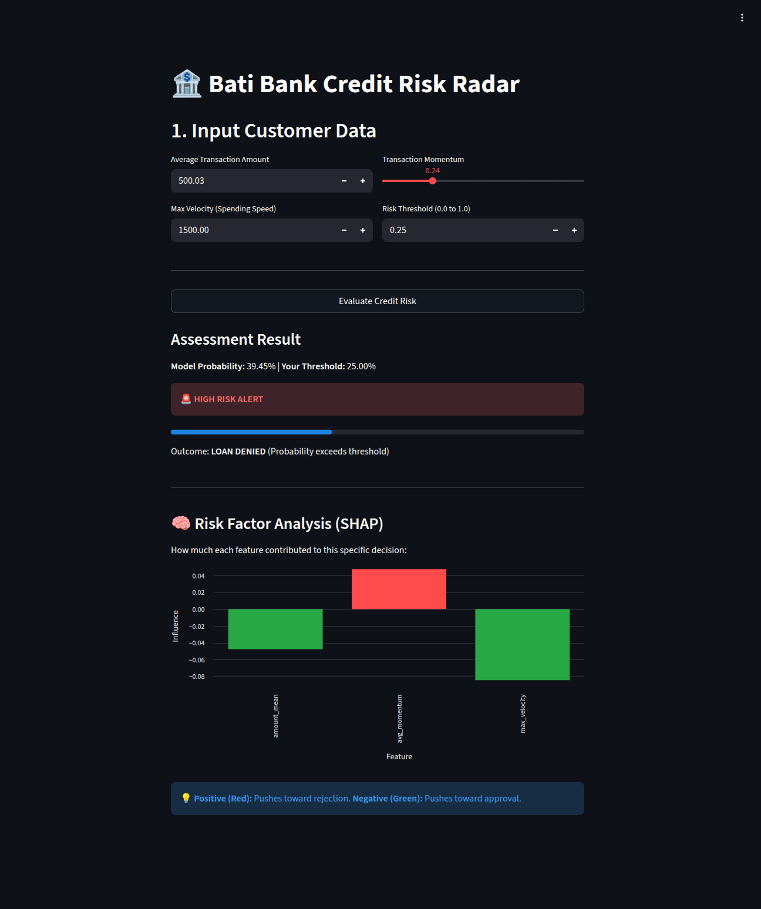

# 💳 Bati Bank Credit Risk Model

[](https://github.com/Feven-TH/credit-risk-model/actions/workflows/ci.yml)

An industrial-grade **MLOps pipeline** for alternative credit scoring.  
This project transforms raw transaction logs into actionable, explainable credit decisions.

---

## 🎯 Business Problem

Bati Bank seeks to expand lending access to customers who lack traditional credit histories.

By analyzing transactional behavior (airtime purchases, utility payments, mobile money transfers), the bank can:

- Identify creditworthy individuals otherwise excluded from credit systems  
- Reduce default exposure through data-driven risk segmentation  

---

## 🚀 Solution Architecture

### 🔄 End-to-End Pipeline

- **Labeling**  
  Raw transaction data is processed using **RFM Analysis + K-Means Clustering** to generate High/Low risk segments.

- **Feature Engineering**  
  Extracts behavioral signals such as **transaction velocity** and **spending momentum**.

- **Modeling**  
  A **Random Forest classifier** trained on generated labels, optimized via **Optuna Bayesian tuning**.

- **Deployment**  
  A production-ready **FastAPI service** serving real-time risk scores with integrated **SHAP explanations**.

---

## 🛠 Engineering Level-Ups

Beyond baseline modeling — this pipeline solves real production challenges.

### ⚖️ Deterministic Risk Labeling

Standard K-Means can cause *label flipping* between runs.  
This system enforces stable segmentation using:

- Fixed initialization  
- Consistent RFM scaling  
- Persistent cluster-to-risk mapping  

Ensuring "High Risk" remains consistent across the model lifecycle.

---

### 🧪 Cold-Start CI Bridge

CI pipelines often fail in clean environments without access to large datasets.

To solve this, the workflow generates **synthetic balanced data on-the-fly**, allowing:

- Full unit + integration testing  
- No dependency on 10GB transaction databases  
- Reliable GitHub Actions execution  

---

### 🏆 Dynamic MLflow Aliasing

Instead of manual promotion, the pipeline implements automated model governance:

- New models are evaluated against the current **Champion**
- If metrics improve, MLflow automatically updates the **production alias**

The API always serves the best-performing model version.

---

### 🔍 Explainable AI (XAI) as a Service

Predictions return more than probabilities.

FastAPI responses include SHAP-based **Reason Codes**, enabling transparency such as:

- “Risk increased due to 300% spike in transaction velocity”

A key requirement for financial compliance and trust.

---
## 🚀 Quick Start
Everything is automated via the Makefile.

### Bash Commands:

### 1. Build the Docker environment
```
  make build
```
### 2. Run the full test suite (Uses our mock registry strategy)
```
  make test
```
### 3. Start the Production API
```
    make up
```
### 4. Launch the Dashboard
```
    streamlit run src/ui/app.py
```

# 📂 Project Structure

- **.github/workflows/**  	# CI/CD (GitHub Actions)
- **core/**  			# Core ML Logic (Feature Engineering, Labeling)
- **data/**  			# Data storage (Raw/Processed)
- **models/**  		# Saved model artifacts (.pkl)
- **src/**
  - **api/**  			# FastAPI implementation
  - **train.py**  	# Production training script
- **tests/**  			# Integration & Unit tests
- **mlflow.db**  	# Local MLflow Registry
- **requirements.txt**  # Project dependencies

## 📊 Evaluation
- **Model:** RandomForestClassifier (Optuna-optimized)
- **Metrics:** 92%+ ROC-AUC; validated via stratified sampling in CI to ensure class balance.
- **Stability:** K-Means labels are validated for consistency across training runs to prevent "label flipping."
---

# 🎥 Demo

This project includes an interactive **Streamlit dashboard** that allows stakeholders to explore customer risk segmentation, feature behavior, and real-time model outputs.

## 📊 Credit Risk Dashboard (Streamlit)

The dashboard provides:

- Customer risk distribution (High vs Low Risk)
- Behavioral transaction insights (velocity, momentum)
- Explainable predictions using SHAP reason codes

<p align="center">  </p>
# 👤 Author

**Feven Tewelde**

- [LinkedIn](https://www.linkedin.com/in/feven-tewelde/)
- [GitHub](https://github.com/Feven-TH)
